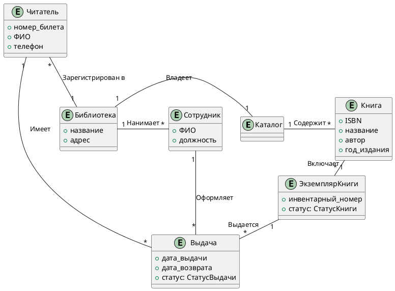

```plantuml
@startuml Библиотечная Информационная Система (Модель предметной области)

entity Каталог {
}

entity Книга {
  + ISBN
  + название
  + автор
  + год_издания
}

entity ЭкземплярКниги {
  + инвентарный_номер
  + статус: СтатусКниги
}

entity Читатель {
  + номер_билета
  + ФИО
  + телефон
}

entity Выдача {
  + дата_выдачи
  + дата_возврата
  + статус: СтатусВыдачи
}

entity Сотрудник {
  + ФИО
  + должность
}

entity Библиотека {
  + название
  + адрес
}

' Связи между сущностями
Книга "1" -right- "*" ЭкземплярКниги : Включает
Каталог "1" -right- "*" Книга : Содержит

Читатель "1" -right- "*" Выдача : Имеет
ЭкземплярКниги "1" -right- "*" Выдача : Выдается

Сотрудник "1" -down- "*" Выдача : Оформляет
Библиотека "1" -right- "*" Сотрудник : Нанимает
Библиотека "1" -right- "1" Каталог : Владеет

Читатель "*" -down- "1" Библиотека : Зарегистрирован в

@enduml
```
